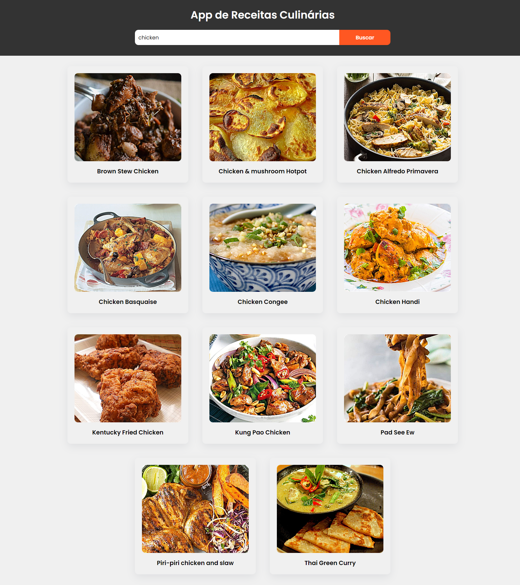

### Site de Receitas Culinárias
Neste tutorial ([Abrir no Youtube](https://youtu.be/VRgA9NkhSEk)), Monstra como programar um site de receitas culinárias usando JavaScript. Além disso, este projeto é totalmente responsivo e você pode usá-lo em seus projetos de desenvolvimento web 

